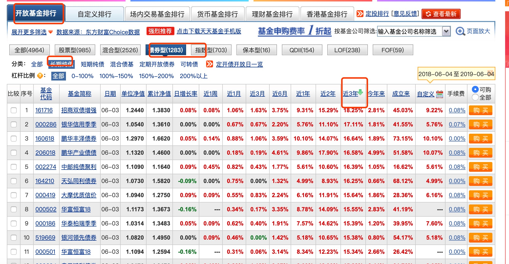
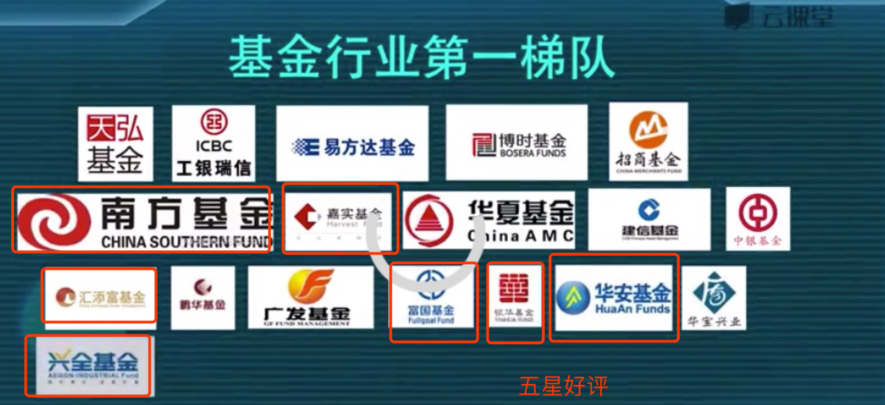

https://www.youtube.com/watch?v=HwGIab7KVp8&list=PLYtO8EzdUTxettH9QRNS74BRH2CbqGEyA&index=8

## 货基ETF 

t+0 交易

#### 华宝天意：
一万起步

两个价格，厂内价格，厂外价格

每月结算一次利息，

多种套利策略

#### 银华日利

## 银行拆借利率 

shbier

隔夜利率

#### 国债逆回购

考虑7天以内

第9课 

### 如何选择债基

然后点击前30个

1剔除可转债的基金
2 剔除20大于20亿的
3 剔除一个基金公司旗下非王牌的

只留王牌的纯债基金

找出综合费率最小，----成立时间最长的，-----基金经历年纪最大的，管理时间较海长的

A，B类都收费，

定期开发债基

单位净值

累计净值

第12课
股票型基金

尽量选择大型基金公司
千亿以上规模的基金

